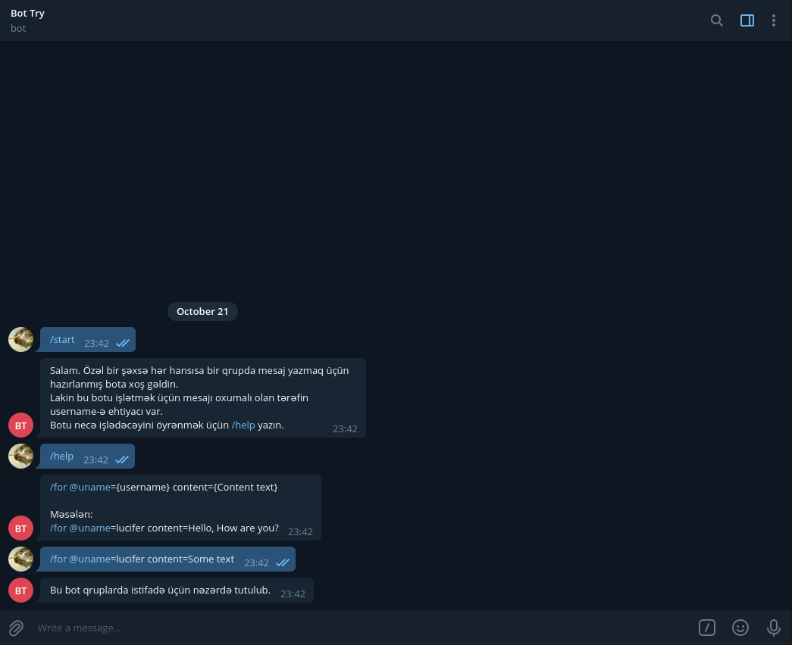
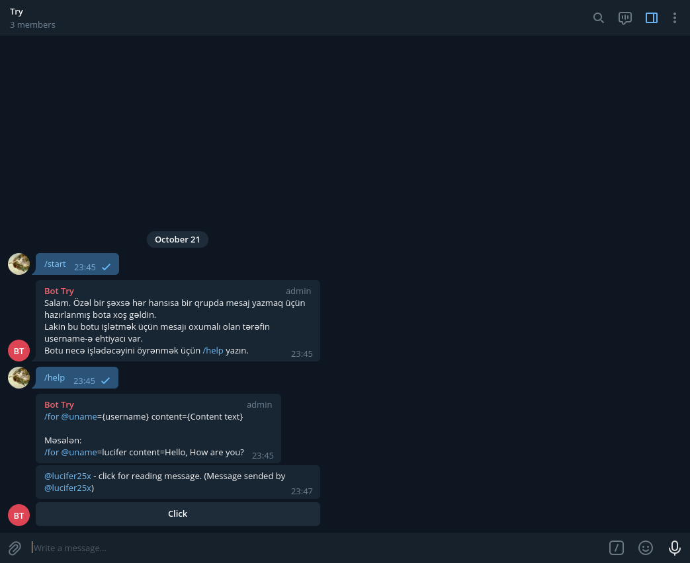

# Send private messages on chat (Telegram Bot)
### Usage:
```
/for @uname=username content=Some Text
```

### Create your own bot:
* Clone repository:
```sh
https://github.com/Lucifer25x/secureMessage.git
```
* Install dependencies:
```sh
npm install
```
* Create `.env` file:
```sh
touch .env
```
* Paste your bot token to `.env` file like this:
```
TOKEN=your_token
```
* Start project 
```sh
npm start
```
## Screenshots


